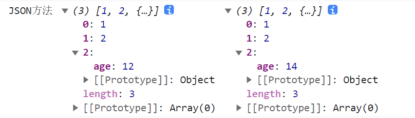
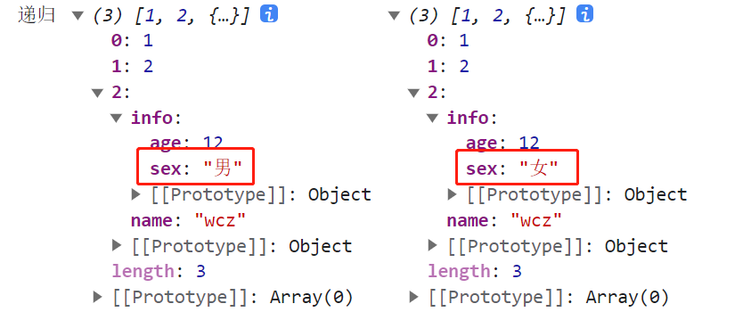
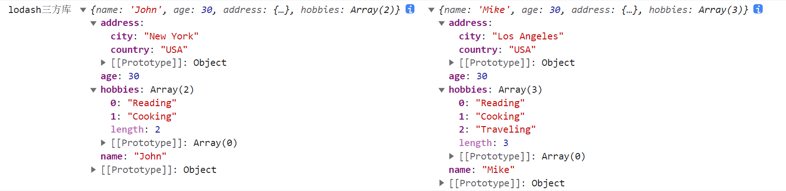

## 1. 深入理解深浅拷贝

### 1.1 浅拷贝

> 原理

​	浅拷贝是指在复制对象或数组时，仅复制它们的引用而不是实际的值。也就是说，原始对象和新复制的对象共享相同的内存地址，当修改其中一个对象时，另一个对象也会受到影响。


> 实现方法

- **Object.assign()** : 该方法将所有可枚举的自身属性从一个或多个源对象复制到目标对象。它返回目标对象。

```js
// Object.assign(新对象, ...源对象)
let obj = {x:123,y:'abc'}
let newObj = {}
// 将obj浅拷贝到newObj中
Object.assign(newObj,obj)
console.log(newObj) // {x:123,y:'abc'}
```


- **Array.Prototype.concat()**: 该方法用于合并两个或多个数组。此方法不会更改现有数组，而是返回一个新数组。

```js
// 将arr数组数据浅拷贝到newArr中
let arr = [1,2,3,4,5]
let newArr = arr.concat()
console.log(newArr) // [1,2,3,4,5]
```


- **Array.Prototype.slice()**: 该方法返回一个新的副本对象，该对象是一个由 `begin`和`end`决定的原先的**浅拷贝**（包括`begin`，不包括`end`，左闭右开）。原始序列不会被改变。

```js
// arr.slice(begin,end),对数组arr进行切片，从begin位置开始，end位置结束(不包括end位置)，返回一个新的切片后的数组，如果slice不传参则拷贝整改数组
let arr = [1,2,3,4,5]
let newArr = arr.slice()
console.log(newArr) // [1,2,3,4,5]
```


### 1.2 深拷贝

> 原理

​	深拷贝是指在复制对象或数组时，创建一个全新的对象或数组，并且递归地复制其所有子对象和子数组，使得原始对象和新复制的对象完全独立，互不影响。

> 实现方法

- **JSON方法**：利用`JSON`方法的`parse()`和`stringify()`方法实现深拷贝：

```js
// 原数组
let arr3 = [1,2,{age:12}]
// 深拷贝arr3
let newArr3 = JSON.parse(JSON.stringify(arr3))
// 修改原数组
arr3[2].age = 14
console.log('JSON方法',newArr3,arr3)
```



- **递归方法实现深拷贝**：递归方法实现深度克隆原理：遍历对象、数组直到里边都是基本数据类型，然后再去复制，就是深度拷贝。

```js
// 定义检测数据类型的功能函数
function checkedType(target) {
    // 返回对象的数据类型
    return Object.prototype.toString.call(target).slice(8,-1)
}
// 实现深度克隆--对象/数组
function clone(target) {
    // 判断拷贝的数据类型
    let result,targetType = checkedType(target)
    if (targetType == 'Object') {
        result = {}
    } else if (targetType == 'Array') {
        result = []
    } else {
        return target
    }

    // 遍历目标数据
    for (let i in target) {
        let value = target[i]
        if (checkedType(value) == 'Object' || checkedType(value) == 'Array') {
            result[i] = clone(value)
        } else {
            result[i] = value
        }
    }

    return result
}
// 原始数据对象
let arr4 = [1,2,{name:'wcz',info: {age:12,sex:'男'}}]
// 深拷贝
let newArr4 = clone(arr4)
// 修改原始对象
arr4[2].info.sex = '女'
// 打印结果对比修改原始对象是否影响拷贝后的对象
console.log('递归',clone(newArr4),arr4)
```



- **函数库lodash**：该函数库也有提供 **_.cloneDeep**用来做深拷贝。

```js
// 引入lodash
<script src="https://cdn.jsdelivr.net/npm/lodash@4.17.21/lodash.min.js"></script>

// 原始数据对象
const originalObj = {
    name: "John",
    age: 30,
    address: {
        city: "New York",
        country: "USA"
    },
    hobbies: ["Reading", "Cooking"]
};

// 使用_.cloneDeep()进行深拷贝
const clonedObj = _.cloneDeep(originalObj);

// 修改新复制的对象
clonedObj.name = "Mike";
clonedObj.address.city = "Los Angeles";
clonedObj.hobbies.push("Traveling");

// 输出原始对象和新复制的对象
console.log('lodash三方库',originalObj,clonedObj);

```

